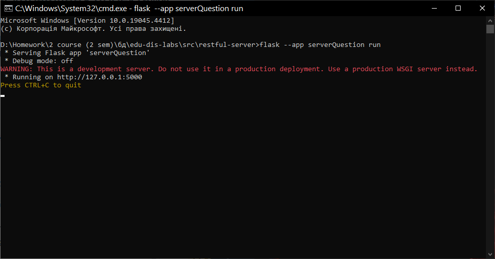
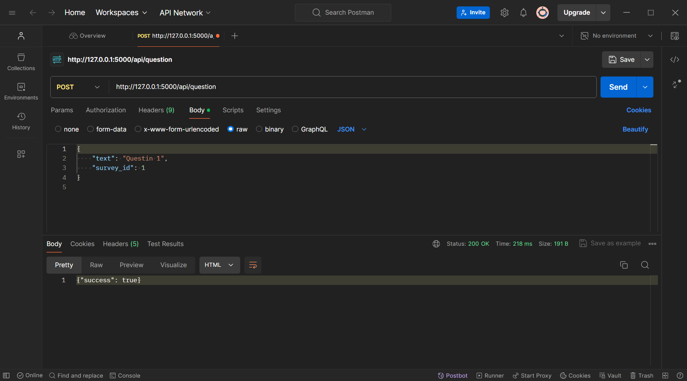
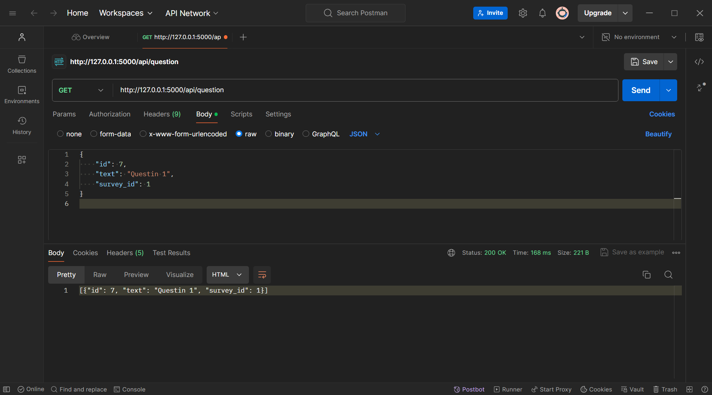
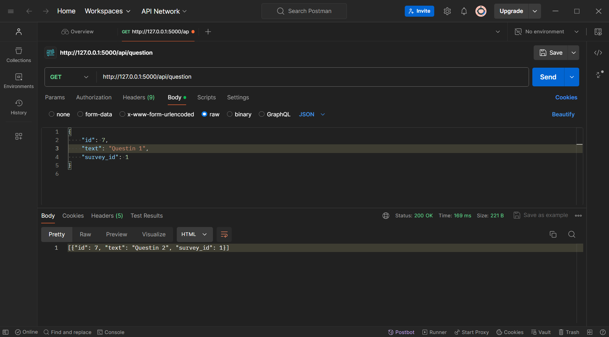
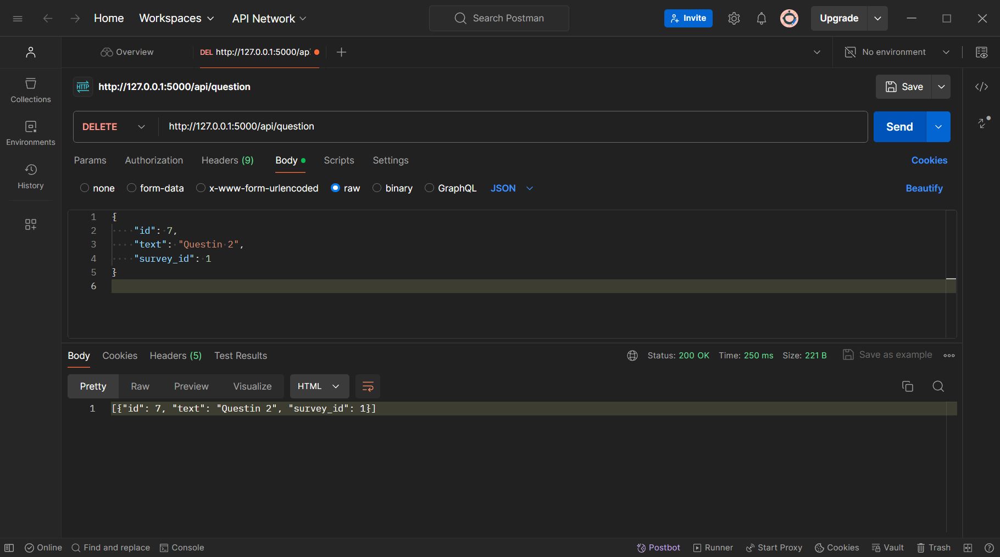
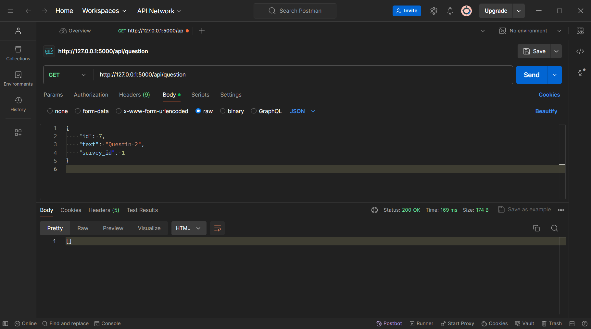

# Тестування працездатності системи
Для тестування системи використовувся додаток Postman
## Запуск сервера
 

## Метод POST

### POST QUESTION
#### Запит та відповідь
 

#### Перевірка за допомогою GET
 

## Метод PUT

### PUT QUESTION
#### Запит та відповідь
 

#### Перевірка за допомогою GET
 
 
 ## Метод DELETE

### DELETE QUESTION
#### Запит та відповідь
 

#### Перевірка за допомогою GET
 
 
 
